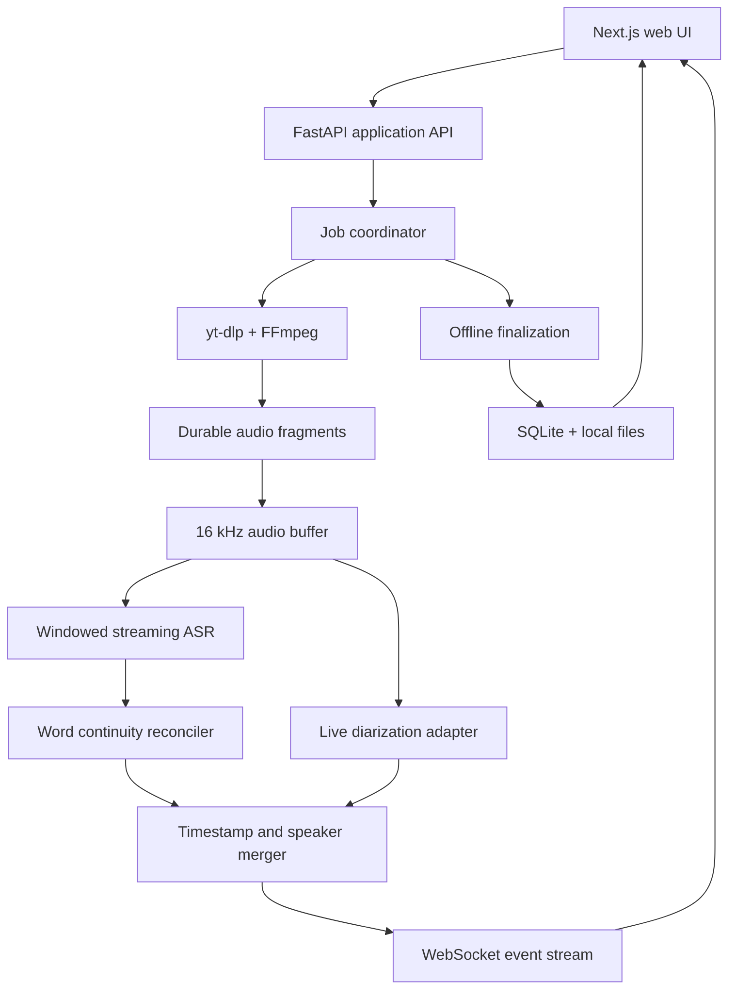
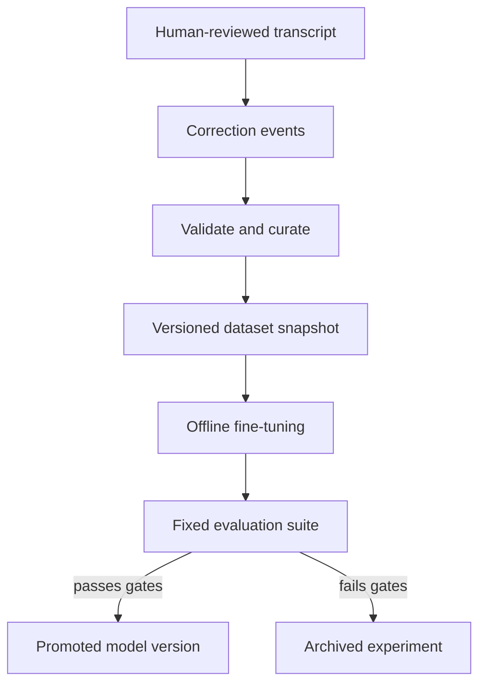

# Live Transcription Service — Product and Technical Spec

**Status:** Draft v1.4  
**Date:** 2026-08-18  
**Working title:** Local Transcript Service  
**Primary deployment:** One-user, self-hosted, local-first web application  

## 1. Executive summary

Build a local-first web application that accepts a public audio/video URL, preserves an accessible master-audio copy, transcribes it while it plays, distinguishes multiple speakers, and presents the result in a minimal review interface. The user can rename anonymous speaker labels, correct text, review uncertainty and overlap, download or delete audio, and export the transcript.

The recommended implementation is fully self-hosted and has no per-minute API cost:

- **Web UI:** Next.js and TypeScript
- **Application/AI API:** Python with FastAPI
- **Audio ingestion:** `yt-dlp` plus FFmpeg
- **Speech-to-text:** `faster-whisper`, using quantized GPU inference
- **Live speaker diarization:** a replaceable diarization adapter, initially benchmarked between Diart and NVIDIA Streaming Sortformer
- **Final speaker refinement:** `pyannote.audio` Community-1 after the stream ends
- **Storage:** SQLite plus local files
- **Remote access:** Tailscale Serve for private access; Tailscale Funnel for intentionally public access

The app must not promise a perfectly stable speaker label the moment someone begins speaking. Live labels are provisional and may be revised as more audio arrives. The finalization pass produces the stable labels used for review and export.

The implementation must also include a deliberate improvement loop: user-approved transcript and speaker corrections are retained as structured annotations, converted into versioned training datasets, evaluated, and used to fine-tune or calibrate future model versions. Training remains separate from serving so that a failed experiment can never silently alter production behavior.

## 2. Product definition

### 2.1 Problem

Existing transcription services commonly charge by audio minute, upload recordings to a third party, or expose complicated controls. The intended product should keep the workflow to five actions:

1. Paste a link.
2. Start transcription.
3. Watch the live transcript.
4. Review text and name the speakers.
5. Export.

### 2.2 Terminology

- **Transcription:** converting speech to text.
- **Speaker diarization:** deciding *which anonymous speaker spoke when* (`Speaker 1`, `Speaker 2`).
- **Speaker identification:** attaching a real identity to a voice. This is not automatic in the MVP. The user names each detected speaker during review.
- **Live result:** low-latency, provisional text and speaker labels.
- **Final result:** stabilized text and speaker labels after the post-processing pass.
- **Inference window:** a bounded audio interval submitted to the ASR model; it is an internal processing unit, not a transcript turn.
- **Transcript turn:** continuous speech attributed to one speaker; it may span many inference windows and contain several display paragraphs.
- **Committed frontier:** the latest timestamp before which live words are considered stable and no longer routinely rewritten.

### 2.3 Goals

- Zero usage fees after installation; electricity and storage are the only operating costs.
- Run on either an RTX 3050 Ti Mobile with 4 GB VRAM or an RTX 3050 with 6 GB VRAM.
- Show useful text within seconds of audible speech.
- Distinguish recurring speakers throughout a session.
- Keep all audio and transcript data on the host by default.
- Support both local-only and remotely accessible deployment.
- Provide a simple, responsive interface with very few visible controls.
- Preserve timestamps and speaker labels in exported files.
- Keep ingestion, ASR, diarization, attribution, post-processing, export, training, and evaluation replaceable behind stable interfaces.
- Convert consented human corrections into traceable ASR and diarization training candidates.
- Support model experimentation, comparison, promotion, and rollback without changing stored transcripts.
- Preserve a speaker's continuous turn across ASR window boundaries without duplicated, omitted, or artificially separated text.
- Support intra-sentence and inter-sentence code-switching among English, Tagalog/Filipino, and Cebuano/Bisaya without translating the speaker's words.
- Preserve simultaneous speaker activity and, where technically recoverable, separate text hypotheses for each overlapping speaker.
- Preserve source-relative and wall-clock time through capture, recovery, review, and export.
- Make original and derived audio assets easy to inspect, download, retain, or delete independently.

### 2.4 Non-goals for the MVP

- Automatically determining a person's real name from their voice.
- Circumventing DRM, paywalls, site authentication, or platform restrictions.
- Supporting many simultaneous transcription jobs on one 4–6 GB GPU.
- Guaranteed per-speaker word recovery from single-channel overlapping speech; mono separation is a best-effort final-pass feature.
- Collaborative multi-user editing.
- Mobile-native applications.
- Translation, summarization, or AI-generated meeting notes.
- Automatically retraining or deploying a model after every correction.

## 3. Key product decisions

| Decision | Selected approach | Reason |
| --- | --- | --- |
| Cost model | Self-hosted inference | Avoids expiring free tiers and per-minute fees. |
| Job concurrency | One active GPU job | Predictable latency and memory use on RTX 3050-class hardware. |
| Speaker names | User-assigned | Diarization identifies anonymous voices, not real identities. |
| Live accuracy | Provisional transcript | Streaming systems need later context to correct partial words and speaker clusters. |
| Export quality | Final offline refinement | The full recording provides better diarization context than a live stream. |
| Remote access | Private by default | Transcripts may contain confidential or student-related information. |
| Database | SQLite | Sufficient for a single host and simple to back up. |
| Audio retention | Configurable, default 7 days | Enables review and reprocessing without indefinite retention. |
| Core extensibility | Versioned ports and adapters | Models and media sources can change without rewriting job, storage, or UI logic. |
| Learning loop | Curated, opt-in dataset snapshots | Corrections are useful labels, but only after validation and consent. |
| Model deployment | Explicit evaluation and promotion | Prevents regressions, poisoning, and accidental production changes. |
| Lag priority | Capture first, transcribe second | A delayed transcript can be recovered from saved audio; audio that was never captured cannot. |
| History deletion | Trash plus explicit permanent purge | Supports accidental-deletion recovery and privacy-driven immediate deletion. |
| Source audio | Preserve a high-quality master plus inference derivatives | Keeps channel information for overlap recovery and lets the user download, reprocess, or delete each asset. |
| Mixed language | `auto-mixed` mode for `en`, `tl`/`fil`, and `ceb` | A session-level single-language choice is incorrect for routine code-switching. |
| Overlap | Preserve both active speakers and per-speaker hypotheses | Diarization alone cannot separate words, so unresolved mono overlap stays explicitly uncertain. |
| Review priority | Issue-driven review queue | Directs attention to low-confidence, overlap, boundary, timing, and language problems. |
| Model backup | Reconstructible GitHub packages by default | LoRA adapters and manifests fit a zero-cost workflow better than duplicating full base checkpoints. |
| External credentials | Hugging Face token available only to training/model-acquisition tooling | Serving and the web/API remain offline-capable and cannot leak the token. |

## 4. Primary user experience

### 4.1 Screen 1 — Home

Visible elements:

- Product name
- One large URL field: `Paste an audio, video, or live-stream link`
- One primary button: `Transcribe`
- Small recent-sessions list below the fold

The URL field should accept paste automatically and show a compact validation state. Advanced settings stay behind a small settings icon and are not required for a normal job.

### 4.2 Screen 2 — Live transcript

Visible elements:

- Source title and `LIVE` or processing status
- Elapsed source time
- Transcript stream with colored speaker labels
- One primary action: `Stop & finalize`
- Overflow menu for cancel/delete and diagnostics

Behavior:

- Auto-scroll follows the newest segment unless the user scrolls upward.
- Unstable text is visually muted; committed text is normal.
- A changing speaker cluster may temporarily appear as `Speaker ?`.
- Network or source interruptions show a non-blocking reconnect state.
- When inference lags but audio capture remains healthy, show `Transcript delayed — audio is still being saved`.
- In record-only fallback, keep the existing transcript readable and show that remaining audio will be processed after the stream.
- Refreshing the browser reconnects to the current job rather than starting another.

### 4.3 Screen 3 — Review

Visible elements:

- Audio player with seek bar
- Transcript organized into speaker turns
- Clickable speaker labels
- Compact `Next issue` control with unresolved-issue count
- `Audio files` drawer showing format, channels, sample rate, size, and retention state
- One primary action: `Export`

Interactions:

- Clicking `Speaker 1` opens a small inline rename field.
- Renaming updates every turn assigned to that speaker.
- Clicking transcript text enables inline editing.
- Clicking a timestamp seeks the audio player.
- Adjacent turns can be merged.
- A turn can be reassigned to another speaker.
- Overlap regions show every active speaker in stacked, color-coded rows and carry an `Overlapping` badge.
- Unresolved mono overlap shows separate tentative hypotheses only when available; otherwise it shows the mixed hypothesis without inventing speaker-specific words.
- Low-confidence text, uncertain language, speaker conflict, timeline gaps, suspected boundary repairs, and unresolved overlap enter a review queue; `Next issue` seeks the audio and focuses the relevant edit.
- The user can download the master or an inference/derived audio asset and can delete an individual asset after an impact warning.
- Undo is available for edits made during the current browser session.

### 4.4 Screen 4 — Export dialog

MVP formats:

- Plain text (`.txt`)
- Markdown (`.md`)
- WebVTT (`.vtt`)
- SubRip captions (`.srt`)
- Structured JSON (`.json`)

Export options:

- Include or omit timestamps
- Include or omit speaker names
- Use edited transcript or original machine output
- Timestamp basis: source-relative, wall-clock, or both when wall-clock mapping is available
- Overlap layout: readable stacked cue, parallel timed cues, or separate per-speaker tracks

JSON is the lossless interchange format for overlap. WebVTT uses voice spans such as `<v Speaker 1>` and may use overlapping cues; the W3C examples explicitly allow concurrent, positioned speaker cues. SRT has no equivalent structured speaker/overlap model, so the default SRT profile places both labeled utterances as separate lines inside one shared timed cue. An advanced parallel-cue profile may emit same-time cues, but playback varies by application. A per-speaker export produces separate SRT/VTT files plus a manifest.

### 4.5 Screen 5 — History and trash

The home screen links to a full `History` view while retaining only a short recent-session list on the home screen.

History rows show:

- Title/source
- Created date and duration
- Status and processing mode
- Speaker count and detected language
- Storage used
- Master-audio availability and derived-asset count
- Open, export, retry/finalize, and overflow actions

History supports search, status/date filters, sorting, multi-select, and bulk delete. A row's `Audio files` action provides direct download and per-asset deletion. Selecting `Delete` moves sessions to Trash and immediately removes them from ordinary history. Trash shows the scheduled permanent-purge date and supports `Restore` or `Delete permanently`.

Before permanent deletion, show a compact impact summary: transcript, audio, exports, logs, corrections, approximate bytes, and whether the session was included in a training dataset. Ordinary unapproved sessions can be purged immediately. If an approved example already contributed to a dataset/model, explain that deleting the source prevents future reuse but cannot selectively remove its influence from an already-trained model; full removal requires invalidating affected datasets and retraining descendants.

## 5. Functional requirements

### 5.1 Source ingestion

- **FR-001:** Accept `http` and `https` URLs.
- **FR-002:** Resolve supported public media pages through `yt-dlp`.
- **FR-003:** Accept direct HLS, DASH, RTMP, and ordinary media URLs when FFmpeg supports them.
- **FR-004:** Select a usable audio-only source without downloading video; when alternatives exist, prefer the highest-quality audio that remains practical for local storage.
- **FR-005:** Normalize incoming audio to mono, 16 kHz PCM for inference.
- **FR-006:** Detect whether the source is live or finite.
- **FR-007:** Preserve a master audio asset while the job runs, retaining the source codec/container, sample rate, and channel layout when technically possible, and separately create normalized inference audio.
- **FR-008:** Return a clear unsupported-source error without exposing internal command output.
- **FR-009:** Reject local-file schemes, loopback/private-network targets, and unsafe redirects supplied through the public UI.
- **FR-010:** Do not attempt DRM bypass or authenticated scraping in the MVP.
- **FR-011:** Expose every completed audio asset in the review/history UI with metadata, checksum status, download, and delete actions.
- **FR-012:** Support byte-range downloads and resumable delivery for large master assets.
- **FR-013:** Never delete an asset still being written; stopping capture and atomically finalizing the asset is required first.
- **FR-014:** When deleting a master, warn which reprocessing, overlap-separation, export, and future-training capabilities will be lost; permit derived inference audio to be retained independently.

`yt-dlp` supports many extractors and provides experimental “live from start” support only for selected sites. Therefore, the initial release should promise **current-position live capture**, not universal capture from the beginning of every live stream.

### 5.2 Live transcription

- **FR-020:** Begin audio processing without waiting for the full media file.
- **FR-021:** Use a rolling audio buffer and overlapping context windows.
- **FR-022:** Publish partial and committed transcript events separately.
- **FR-023:** Produce word-level timestamps when supported.
- **FR-024:** Default to `auto-mixed` recognition with allowed languages English (`en`), Tagalog/Filipino (`tl`/`fil`), and Cebuano/Bisaya (`ceb`); never force one language for the entire session unless the user explicitly chooses it.
- **FR-025:** Keep committed text stable; later corrections should replace a bounded recent region only.
- **FR-026:** Backpressure the input pipeline when inference falls behind rather than exhausting memory.
- **FR-027:** Show a warning when processing delay exceeds 15 seconds.
- **FR-028:** Use overlapping inference windows and reconcile their word-level hypotheses before committing text.
- **FR-029:** Maintain a revisable transcript tail and a monotonic committed frontier.
- **FR-030:** Never create a visible speaker turn solely because an ASR inference window ended.
- **FR-031:** Retain bounded context from previously committed text while preventing prompt errors from propagating indefinitely.
- **FR-032:** Detect and remove duplicated overlap words using timestamps plus normalized token-sequence matching.
- **FR-033:** Detect potential missing boundary words and re-decode the affected overlap before advancing the committed frontier.
- **FR-034:** Preserve inference-chunk provenance for diagnostics without exposing chunks as editable transcript units.
- **FR-034A:** Preserve original orthography and spoken language rather than translating Cebuano/Tagalog into English or normalizing Cebuano into Tagalog.
- **FR-034B:** Store optional language tags and confidence at word/span level, allow review-time correction, and use corrected tags as supervised data.
- **FR-034C:** Treat code-switch boundaries as likely uncertainty regions and include intra-sentence switching in the fixed evaluation set.

### 5.3 Speaker handling

- **FR-035:** Assign anonymous speaker IDs during the live session.
- **FR-036:** Reuse a speaker ID when the same voice returns.
- **FR-037:** Permit live speaker labels to be corrected before they are finalized.
- **FR-038:** Run a full-session diarization pass when the job ends.
- **FR-039:** Reconcile word timestamps with final speaker turns.
- **FR-040:** Preserve all active speaker intervals in overlap regions and display every active speaker, not only a primary label.
- **FR-041:** Allow global rename, per-turn reassignment, merge, and split operations.
- **FR-042:** Store speaker color independently from speaker name.
- **FR-043:** Merge adjacent same-speaker words across inference boundaries when no genuine speaker change occurred.
- **FR-044:** Permit readability paragraph breaks inside a long turn without repeating the speaker label or changing speaker attribution.
- **FR-044A:** Detect overlapping speech live when the diarization adapter supports it and revise the overlap region during finalization.
- **FR-044B:** For multi-channel sources, retain channels and prefer channel-aware ASR/attribution before attempting source separation.
- **FR-044C:** For mono overlap, optionally run a replaceable speech-separation and per-stem ASR adapter during finalization, then map stems to speakers by embeddings and timing; never present low-confidence stem text as certain.
- **FR-044D:** Store zero or more per-speaker text hypotheses and confidence for each overlap region. Diarization activity alone must not be treated as proof of what each speaker said.

### 5.4 Session management

- **FR-045:** Persist job progress so a page refresh does not lose the active session.
- **FR-046:** Support states: `queued`, `connecting`, `live`, `finalizing`, `ready`, `failed`, `cancelled`.
- **FR-047:** Permit one active inference job and queue additional jobs.
- **FR-048:** Show session title, source URL, creation time, duration, language, status, and speaker count.
- **FR-049:** Permit re-finalization after changing the diarization model or expected speaker count.
- **FR-050:** Permit deletion of a session and all associated audio/export files.
- **FR-057:** Provide searchable/filterable history with single- and multi-session selection.
- **FR-058:** Move deleted sessions to a recoverable Trash view, with explicit restore and permanent-purge actions.
- **FR-059:** Before permanent deletion, calculate affected files, corrections, datasets, and model lineage and show the impact to the owner.

### 5.5 Editing and export

- **FR-051:** Preserve the original machine transcript separately from user edits.
- **FR-052:** Autosave edits locally within two seconds.
- **FR-053:** Generate exports from the latest saved revision.
- **FR-054:** Escape caption and JSON output safely.
- **FR-055:** Include source metadata and model versions in JSON exports.
- **FR-056:** Segment SRT/VTT caption cues for readability independently from semantic speaker turns.
- **FR-056A:** Export lossless overlap, language, confidence, issue, source-time, and wall-clock mappings in versioned JSON.
- **FR-056B:** Support readable, parallel, and per-speaker overlap profiles for SRT/VTT, with readable stacked cues as the compatibility default.
- **FR-056C:** Use WebVTT voice spans for speaker identity; document that renderer behavior for simultaneous cues varies and that SRT cannot preserve the full semantic overlap model.

### 5.6 Continuous improvement and training data

- **FR-060:** Store the immutable original prediction separately from the corrected result.
- **FR-061:** Record every text, timing, speaker, split, merge, and reassignment edit as an append-only correction event.
- **FR-062:** Let the owner mark each session as `excluded`, `candidate`, or `approved` for model training; default to `excluded`.
- **FR-063:** Preserve the exact audio interval, original output, corrected label, model version, editor, and edit time for every candidate.
- **FR-064:** Validate candidates for missing audio, clipped speech, timestamp mismatch, empty labels, excessive duration, and unresolved overlap.
- **FR-065:** Build immutable, reproducible dataset snapshots from approved candidates.
- **FR-066:** Split train, validation, and test data by complete session/source—not randomly by nearby audio clips—to reduce data leakage.
- **FR-067:** Support separate dataset builders for ASR, diarization, VAD, and optional known-speaker enrollment.
- **FR-068:** Run training outside the live inference worker and never while a live job is using the same constrained GPU.
- **FR-069:** Register every trained artifact with its base model, dataset snapshot, configuration, code revision, metrics, license, and hardware profile.
- **FR-070:** Require explicit promotion before a model becomes the serving default.
- **FR-071:** Keep the previous production model available for immediate rollback.
- **FR-072:** Permit reprocessing a copied transcript with a candidate model for comparison without overwriting the original session.
- **FR-073:** Export approved datasets in portable formats, including JSONL/WAV for ASR and RTTM/manifest files for diarization.
- **FR-074:** Allow a correction to be excluded or withdrawn from future dataset snapshots.
- **FR-074A:** Keep reviewed overlap rather than discarding it globally, but route it by task: include it for overlap detection/diarization; include it for separation or multi-talker ASR only with per-speaker reference text; exclude unresolved mixed mono overlap from the clean single-speaker ASR training split.
- **FR-074B:** Keep unresolved overlap in a dedicated hard evaluation split so improvements are measurable without contaminating clean training.
- **FR-074C:** Tag every example with one or more BCP 47 language codes and a `code_switched` flag; preserve span-level tags when reviewed.

### 5.7 Lag detection, recovery, and fallback

- **FR-075:** Write normalized audio to durable, ordered fragments before submitting it to ASR or diarization.
- **FR-076:** Measure source/capture lag, inference backlog, and browser event-delivery lag independently.
- **FR-077:** Maintain processing modes: `normal`, `catching_up`, `degraded`, `record_only`, and `recovering_source`.
- **FR-078:** Use audio timestamps and fragment sequence numbers to prevent duplicates after reconnect/restart.
- **FR-079:** Automatically reconnect supported stream protocols using bounded exponential backoff and retry limits.
- **FR-080:** Resume finite/seekable sources from the last durable source timestamp when supported.
- **FR-081:** For live sources with DVR/replay support, request the missing interval before returning to the live edge when practical.
- **FR-082:** If a non-replayable live interval is lost, insert an explicit timeline gap; never fabricate speech or silently collapse time.
- **FR-083:** When inference falls behind but capture is healthy, reduce live decoding cost and process the durable backlog faster than real time.
- **FR-084:** Degradation order is configurable but starts with beam size 1, fewer partial refreshes, larger processing batches, and optional suspension of live diarization before changing ASR models.
- **FR-085:** If the backlog continues growing, enter `record_only`: preserve audio, stop expensive live inference, and queue final transcription after the source ends.
- **FR-086:** A worker restart resumes from the last committed frontier using durable audio fragments rather than restarting the entire session.
- **FR-087:** A browser reconnect replays events after the last acknowledged sequence or loads a current snapshot if replay expired.
- **FR-088:** Show the current fallback mode and whether audio is still being captured using one compact status banner.
- **FR-089:** Enforce free-disk and maximum-retention guards; if capture itself cannot safely continue, stop explicitly and preserve all already-durable data.
- **FR-090:** Record every recovery attempt, mode transition, and unrecoverable gap for diagnostics and export metadata.

### 5.8 Glossary and code-switch assistance

- **FR-091:** Provide versioned session/project glossaries with terms, variants, language (`en`, `tl`/`fil`, `ceb`, or mixed), optional pronunciation hint, casing rule, and notes.
- **FR-092:** Import/export glossary entries as CSV and JSON; allow corrections to propose a glossary entry without adding it automatically.
- **FR-093:** Feed only a bounded, relevant glossary subset into adapters that support prompting/hotwords, and record the glossary version in inference provenance.
- **FR-094:** Treat glossary matches as hints, never forced substitutions; high glossary weight must not turn absent terms into hallucinations.
- **FR-095:** Use the glossary during deterministic final review to suggest, not silently apply, corrections for names, technical vocabulary, Filipino morphology, Cebuano variants, and mixed-language phrases.

### 5.9 Uncertainty-driven review

- **FR-096:** Create review issues for low ASR confidence, conflicting speaker evidence, unresolved overlap, timeline gaps, inferred boundary repair, code-switch/language uncertainty, and out-of-glossary terms.
- **FR-097:** Rank issues by expected correction value using confidence, duration, overlap, model disagreement, and repetition across the session.
- **FR-098:** Provide `Next issue`, previous issue, filters, and status values `open`, `resolved`, `accepted_as_is`, and `not_a_problem`.
- **FR-099:** Seeking to an issue must play contextual audio before and after the region; resolving it records the corresponding correction event.
- **FR-100:** Approved issue resolutions feed the active-learning candidate pool, subject to the same consent and dataset-validation gates as all corrections.

### 5.10 Dual timeline and discontinuities

- **FR-101:** Record source presentation timestamps, source-relative milliseconds, UTC wall-clock capture time, fragment sequence, and a stream-epoch/discontinuity ID whenever the source supplies enough information.
- **FR-102:** Keep source time monotonic within an epoch and never collapse an unavailable interval merely to make the transcript contiguous.
- **FR-103:** Display source-relative time by default and optionally show mapped wall-clock time; exports may contain either or both.
- **FR-104:** Preserve HLS/DASH discontinuities, reconnects, timestamp resets, and DVR jumps as explicit timeline mappings rather than modifying word order silently.

### 5.11 Versioned contracts

- **FR-105:** Every persisted domain record, event payload, export manifest, dataset manifest, training specification, and model-backup manifest carries a schema name and semantic schema version.
- **FR-106:** Readers support documented migrations from retained schema versions; migrations are idempotent, tested on backups, and never rewrite immutable prediction/correction history without producing a new revision.
- **FR-107:** WebSocket compatibility is negotiated by event version; an incompatible browser reloads a compatible snapshot instead of applying unknown deltas.

## 6. Recommended system architecture



### 6.1 Components

#### Web client

- Next.js with TypeScript
- Tailwind CSS or CSS Modules
- TanStack Query for server state
- Native WebSocket client for live events
- Local optimistic editing with server reconciliation

#### Application API

- FastAPI
- Pydantic request and event schemas
- SQLAlchemy or SQLModel
- One in-process job coordinator for the MVP
- A dedicated Python worker process for GPU inference so model crashes do not terminate the web API

#### Extensible core

Use a ports-and-adapters design. Domain objects and job orchestration must not import model-specific packages directly. Each replaceable capability implements a versioned interface:

- `SourceAdapter` — resolves URL, upload, microphone, or future meeting sources
- `AudioDecoder` — produces the canonical PCM stream
- `AudioAssetStore` — preserves, streams, downloads, and purges master/derived assets
- `CaptureStore` — persists sequenced audio fragments and their source timeline before inference
- `VadEngine` — returns speech activity
- `AsrEngine` — returns partial/final words and timestamps
- `ContinuityReconciler` — deduplicates overlaps, repairs window boundaries, and advances the committed frontier
- `DiarizationEngine` — returns provisional/final speaker activity
- `AttributionEngine` — reconciles words and speaker intervals
- `OverlapResolver` — optionally separates mono overlap and returns per-speaker hypotheses
- `TurnBuilder` — groups attributed words independently of inference windows
- `GlossaryProvider` — selects versioned language/domain hints without forcing substitutions
- `ReviewIssueDetector` — produces prioritized, explainable uncertainty items
- `TranscriptPostProcessor` — groups turns and applies deterministic cleanup
- `Exporter` — produces target formats
- `DatasetBuilder` — converts approved corrections into task-specific examples
- `Trainer` — launches a reproducible fine-tuning job
- `Evaluator` — compares candidate and production models
- `ModelRegistry` — resolves approved model artifacts and rollback targets
- `ModelBackupProvider` — creates, verifies, restores, and publishes reconstructible backup bundles
- `DatasetSourceRegistry` — records external-corpus access, license, version, hashes, and permitted use
- `LagMonitor` — measures independent capture, inference, and delivery lag
- `RecoveryPolicy` — selects reconnect, catch-up, degraded, or record-only behavior

All interfaces use internal typed schemas rather than a third-party model's native output. Adapters translate at the boundary. Model configuration is data-driven and selected by a `model_profile_id`, so adding a new model does not require a database migration or UI rewrite.

Package boundaries:

```text
domain/          sessions, transcript, corrections, datasets, model versions
application/     jobs, commands, policies, orchestration
ports/           stable interfaces and event schemas
adapters/        yt-dlp, FFmpeg, Whisper, Diart/Sortformer, pyannote, exporters
infrastructure/  SQLite, files, queues, WebSocket, authentication
training/        builders, trainers, evaluators, registry integration
```

#### Audio pipeline

- `yt-dlp` resolves public page URLs into media streams.
- FFmpeg remuxes/copies a high-quality audio master where supported and independently writes 16 kHz, mono, signed 16-bit PCM for inference.
- PCM is committed into short, ordered audio fragments with source timestamps, checksums, and atomic manifests before inference consumption.
- A bounded ring buffer feeds both ASR and diarization consumers.
- Master and inference audio are separate `AudioAsset` records. Multi-channel masters remain multi-channel so a later channel-aware or overlap pass can use information that mono inference discarded.
- Source stderr is captured into a diagnostic log with credentials and query secrets redacted.

#### Live ASR

- `faster-whisper` with `word_timestamps=True`
- GPU compute type: `int8_float16`
- Silero VAD or a shared VAD stage to avoid processing long silence
- A simultaneous policy based on SimulStreaming/LocalAgreement or AlignAtt: recent text is provisional until the policy considers it stable
- Rolling committed-text context across Whisper's bounded processing windows, with reset rules for repetition, timestamp drift, or low-confidence failure

#### Live diarization

Implement a `Diarizer` interface so the model can be swapped without changing the rest of the application:

```text
push_audio(samples, start_time) -> provisional speaker activity
flush() -> final live-session activity
reset() -> releases state and memory
capabilities() -> max speakers, overlap support, device
```

Benchmark two implementations during the technical spike:

1. **NVIDIA Streaming Sortformer v2.1** — purpose-built streaming model with strong arrival-order labels, but limited to four speakers and primarily trained on English speech.
2. **Diart** — incremental clustering with pyannote segmentation/embeddings; supports real-time diarization but requires gated model downloads and may need dependency adaptation.

Do not make both production dependencies. Select one after measuring latency, diarization error, VRAM, RAM, and install reliability on the target machines.

#### Finalization

When a source ends or the user selects `Stop & finalize`:

1. Flush, checksum, and atomically finalize master and inference audio assets.
2. Commit the last ASR window.
3. Unload the live ASR model from GPU if memory is constrained.
4. Run `pyannote/speaker-diarization-community-1` over the complete recording.
5. Retain ordinary and overlapping diarization timelines. Use exclusive diarization only as a compatibility view for primary word attribution.
6. For overlap, prefer retained independent channels. If the source is mono and the profile enables it, run final-pass separation only on overlap intervals, ASR each stem, and map stems to speaker embeddings.
7. Group consecutive non-overlap words into readable turns and attach overlap regions as first-class parallel content.
8. Generate prioritized review issues and glossary suggestions.
9. Preserve live speaker names by matching old and new clusters using maximum overlapping duration.
10. Mark the session `ready` and notify the browser.

This sequential loading strategy is essential for the 4 GB profile.

#### Overlap truth model

Speaker diarization answers who is active and when; it does not, by itself, determine which words belong to each voice in a mono mixture. The canonical transcript therefore stores an `OverlapRegion` containing all active `SpeakerActivity` records plus zero or more `SpeakerHypothesis` records. A hypothesis includes speaker, text/words, time range, source (`channel`, `separation_stem`, `multi_talker_asr`, or `mixed_asr`), and confidence.

Live mode may show the two active labels and a mixed or provisional hypothesis. The heavier separation pass is optional during finalization because it may not remain real time on 4–6 GB hardware. If separation cannot assign reliable text, the UI must say that the words are unresolved while still preserving the fact that both speakers talked. This is more honest and more useful for later training than assigning the mixed text to a convenient primary speaker.

### 6.2 Boundary continuity and long-speaker handling

ASR window boundaries, diarization intervals, transcript turns, display paragraphs, and caption cues are different layers. They must never share the same identifier or lifecycle.

Recommended live algorithm:

1. Keep a bounded PCM ring buffer, initially 40 seconds.
2. Trigger inference every 1–2 seconds over a rolling 20–30 second context window.
3. Preserve an initial 5–8 second overlap with the previous window.
4. Convert every hypothesis to normalized timestamped words.
5. Align the old and new overlap using timestamps plus token sequence alignment.
6. Remove duplicate words and flag a suspicious unmatched gap for overlap re-decoding.
7. Commit only the stable prefix confirmed by consecutive hypotheses or safely behind a 3–5 second revision margin.
8. Keep the remaining tail replaceable in the UI rather than appending it as a new segment.
9. Attribute committed words to the diarizer's global speaker IDs.
10. Extend the current transcript turn while the global speaker remains the same and no genuine turn-ending condition occurs.

The numerical values are starting presets and must be benchmarked. They belong in a `continuity_profile`, not hard-coded constants.

#### Turn-ending policy

A new transcript turn may begin only when one of these occurs:

- The diarizer reports a sufficiently confident speaker change.
- A reviewed user edit explicitly splits or reassigns the turn.
- A configurable long silence occurs and the product chooses to treat it as a new turn.
- Final reconciliation finds that live speaker attribution was incorrect.

An inference-window end is never a turn-ending condition. A pause shorter than the configured silence threshold should normally remain in the same speaker turn. Start testing with 1.2 seconds for a soft paragraph break and 2.5 seconds for a possible same-speaker turn break, then tune from real data.

#### Long monologues

A speaker may talk continuously for minutes. Store this as one semantic `TranscriptTurn`, but render it as several paragraphs for readability. Paragraph breaks may use punctuation, pauses, and a soft length target such as 30–60 seconds; they do not repeat the speaker label. SRT/VTT exporters still create short caption cues because caption timing constraints are independent of transcript-turn structure.

#### Context policy

Provide only a bounded tail of **committed** text as context for the next decode. Do not blindly chain every previous hypothesis: faster-whisper notes that conditioning on previous text can improve cross-window consistency but can also cause repetition loops or timestamp drift. Reset context when repetition, compression ratio, low log probability, or timestamp monotonicity checks fail.

#### Final boundary repair

The final pass must rerun overlap reconciliation with the complete audio available, then rebuild turns from finalized word timestamps and diarization. User corrections made during the live session are applied as edits over the reconciled word timeline, not by preserving broken live chunk boundaries.

### 6.3 Stream lag and recovery controller

Lag is not one metric:

- **Capture lag:** difference between the source/live edge and the newest durable audio timestamp.
- **Inference lag:** difference between the newest durable audio timestamp and the committed transcript frontier.
- **Delivery lag:** difference between the newest server event and the last event acknowledged by the browser.

The recovery controller uses these independently so a slow browser cannot trigger a model downgrade and slow inference cannot cause the capture process to discard audio.

#### Fallback ladder

| Mode | Trigger example | Behavior |
| --- | --- | --- |
| `normal` | Inference remains close to capture | Full live ASR and live diarization |
| `catching_up` | Small, temporary inference backlog | Beam 1, fewer partial refreshes, larger batches |
| `degraded` | Backlog keeps growing | Prefer smaller serving preset when safe; suspend nonessential live refinement/diarization while capture continues |
| `record_only` | GPU/worker cannot catch up | Stop live inference, keep durable capture, transcribe backlog after the source ends |
| `recovering_source` | No audio/packets from source | Retry/re-resolve the source; preserve timeline and current transcript |

Initial transition thresholds may start around 5, 15, and 60 seconds of inference backlog but must be configurable and benchmarked. Use hysteresis so the service does not rapidly oscillate between modes.

#### Source reconnection

- Use FFmpeg protocol reconnect controls where applicable, including reconnecting streamed inputs and bounded retry delays.
- If the resolved media URL expires, ask the source adapter/yt-dlp to resolve a fresh URL.
- Finite media resumes from the last durable source timestamp.
- DVR-capable live media may request the missing interval, then catch up toward the live edge.
- A non-DVR live stream may be impossible to reconstruct. Insert a `TimelineGap` with wall-clock and source timestamps and show `[audio unavailable during stream interruption]` in timestamped exports.
- Never represent reconnection silence as actual source silence unless timestamps prove that silence was captured.

#### Inference catch-up

The capture process and model worker communicate through a durable fragment queue. The worker may consume fragments faster than wall-clock speed during catch-up. Model changes are a later degradation step because unloading/reloading a model also costs time. The safest final fallback is record-only mode, which sacrifices live captions but preserves the recoverable final transcript.

#### Crash recovery

On restart, rebuild the audio manifest, verify fragment checksums, load the session's exact model profile, and resume inference from a short overlap before the committed frontier. Idempotency keys prevent duplicate words/events. If the same profile cannot load, use the configured fallback profile or leave the job queued for offline finalization.

### 6.4 Learning and model lifecycle



Training is asynchronous and isolated from serving. The application submits a training specification containing dataset ID, base model, method, hyperparameters, seed, and requested hardware. A trainer adapter may execute it on the local machine, another workstation, or a future remote runner while producing the same artifact contract.

Do not implement uncontrolled online learning. Automatic retraining after each edit creates risks of catastrophic forgetting, data poisoning, privacy violations, and non-reproducible behavior. Instead, corrections accumulate in a candidate pool and become trainable only after validation and explicit approval.

### 6.5 What corrections can teach

| User action | Training value | Target |
| --- | --- | --- |
| Correct transcribed words | High, when audio/timestamps are valid | ASR fine-tuning |
| Correct punctuation/casing | Useful, but track separately from spoken-word errors | ASR text normalization |
| Reassign a turn to another anonymous speaker | High | Diarization/attribution |
| Split or merge speaker turns | High when boundaries are reviewed | Diarization and VAD |
| Adjust a turn timestamp | High | Alignment and diarization |
| Rename `Speaker 1` to `Javier` | Metadata only for diarization | Optional known-speaker enrollment |
| Mark overlap or unintelligible audio | High | Quality filtering and overlap handling |

A corrected transcript is therefore **candidate training data**, not automatically a train-ready example. The dataset builder must retain the audio slice and verify that the text describes speech within that slice. Speaker-name changes alone do not train diarization; corrected speaker assignments and time boundaries do.

### 6.6 Fine-tuning strategy

#### ASR

- Fine-tune the original PyTorch/Transformers Whisper checkpoint, not the CTranslate2 inference artifact.
- Start with parameter-efficient LoRA/PEFT rather than full-model training.
- Use 8-bit loading, mixed precision, gradient checkpointing, batch size 1, and gradient accumulation for constrained hardware.
- Target `base` or `small` first on the 4–6 GB machines; larger models may require a stronger GPU or a remote training runner.
- Convert the approved fine-tuned checkpoint to CTranslate2 for `faster-whisper` serving.
- Keep text normalization rules versioned so punctuation edits are not confused with recognition errors.
- Train/evaluate mixed-language utterances, not only separate monolingual clips. Include switches within a sentence and mixed morphology around English technical terms.
- Keep transcript text verbatim and store language-span annotations separately. Use `en`, `tl`/`fil`, and `ceb` as distinct labels; do not relabel Cebuano as Tagalog merely to match a base-model tokenizer.
- Stock Whisper exposes explicit language tokens for English and Tagalog but not Cebuano. Treat Cebuano recognition as a measured low-resource capability requiring representative data and fine-tuning; do not advertise it as solved by multilingual auto-detection alone.
- Compare multilingual auto mode, a constrained allowed-language prior, and a fine-tuned adapter on the same code-switch evaluation set. Never translate during transcription.

#### Diarization

- First improve clustering thresholds, expected speaker count, VAD, and attribution logic; these are cheaper and require less labeled data than model fine-tuning.
- Model fine-tuning requires accurate frame/turn boundaries and speaker assignments, not only transcript text.
- Export corrected annotations to RTTM plus a NeMo/pyannote-compatible manifest.
- Treat Sortformer fine-tuning as a separate high-compute path; do not expect it to train comfortably on 4 GB VRAM.

#### Known-speaker identification

- Keep this separate from anonymous diarization.
- With participant consent, collect several clean enrollment clips and store speaker embeddings.
- Compare new speaker clusters to enrolled embeddings at inference time.
- Prefer enrollment/embedding updates over fine-tuning the full diarization model for each person.

### 6.7 Evaluation and promotion gates

- Maintain a fixed, never-trained-on test suite representative of lectures, meetings, Filipino-accented English, code-switching, noise, and overlap.
- Report WER, normalized WER, DER, speaker-count accuracy, speaker-attributed WER, latency, real-time factor, RAM, and VRAM.
- Compare the candidate against the currently promoted model using identical decoding settings.
- Require no material regression on the general test set and a measurable improvement on the intended domain set.
- Test at least one 60-minute live session before promotion.
- Store evaluation results with the model artifact and require an explicit owner approval.
- Promotion changes only the default model profile; old sessions retain their original model provenance.

### 6.8 Evaluation-corpus automation for the fine-tuning phase

Implement this in Phase 5, not the MVP. A `DatasetSourceRegistry` stores the source URL/DOI, dataset version, license text/hash, approved purposes, redistribution limits, access method, expected files, and integrity hashes. An `EvaluationSuiteBuilder` then performs only explicitly approved steps:

1. Fetch or import an approved corpus through a source adapter.
2. Stop if its recorded license/purpose is absent, changed, incompatible, or requires manual acceptance.
3. Validate checksums, audio readability, transcript encoding, and language metadata.
4. Normalize copies without changing the preserved source package.
5. Deduplicate by audio/content hash and split by speaker, source, and session—not random clips.
6. Freeze test data before training and prohibit the trainer from reading that split.
7. Produce immutable manifests for clean ASR, code-switch ASR, diarization, overlap, and long-turn/boundary suites.
8. Report WER by language and switch direction, code-switch boundary error, DER, overlap-aware DER, speaker-attributed WER, source-separation attribution accuracy, and continuity metrics.

Public-data candidates discovered during planning:

| Source | Relevant content | Current use decision |
| --- | --- | --- |
| UP-DSP Philippine Languages Database | 454+ hours; Filipino, English, Cebuano and other Philippine languages; speech/text pairs | Highest-priority research candidate. Downloadable through Mozilla Data Collective, but CC-BY-NC-4.0 plus research-only, no-redistribution restrictions require a private local cache and license gate. |
| CEnTaCS | Open oral English–Tagalog code-switching story narratives; WAV/text and related files | Strong code-switch evaluation/fine-tuning candidate under CC-BY-NC-SA-4.0; preserve ShareAlike/noncommercial obligations and verify participant-use terms during import. |
| IARPA Babel Cebuano Language Pack | About 191 hours of conversational/scripted Cebuano telephone speech | Technically valuable but licensed/paid through LDC, so exclude from the zero-cost default and keep as a later optional source. |
| Filipino and Bisaya Speech Corpus | Reported 35.88 hours Filipino and 31.85 hours Bisaya in a medical/read-speech domain | Promising, but do not automate until an authoritative download and training license are found. |
| User-approved corrections | Actual lectures/streams, vocabulary, accents, overlap, and code-switching in the target environment | Best domain match. Keep a frozen, consented, source-separated evaluation subset before training on the remainder. |

Do not ingest text-only corpora as speech examples, scrape arbitrary videos, or assume that public access grants model-training or redistribution rights. A small user-recorded held-out suite containing English↔Tagalog, English↔Cebuano, and Tagalog↔Cebuano switches will still be required because monolingual public audio cannot validate the core mixed-language use case.

## 7. Hardware and model profiles

### 7.1 RTX 3050 Ti Mobile — 4 GB VRAM

**Safe default:**

- ASR: Whisper `small` with `int8_float16` on CUDA
- Live diarization: CPU first, or a compact/quantized streaming model after benchmarking
- Final diarization: GPU only after unloading ASR; fall back to CPU if out of memory
- Concurrency: one active job
- Beam size: 1 for live partials; optionally 5 for final correction
- Rolling ASR window: start at 15 seconds with 3–5 seconds overlap

**Quality experiment:** Try `turbo` with `int8_float16` while keeping live diarization on CPU. Retain it only if peak VRAM stays below 3.5 GB and the system remains ahead of real time during a 60-minute test.

### 7.2 RTX 3050 — 6 GB VRAM

**Recommended default:**

- ASR: Whisper `turbo` with `int8_float16` on CUDA
- Live diarization: GPU if the selected implementation keeps total peak VRAM below 5.3 GB; otherwise CPU
- Final diarization: sequential GPU pass
- Concurrency: one active job
- Rolling ASR window: 15–25 seconds with adaptive overlap

### 7.3 CPU-only fallback

- ASR: Whisper `base` or `small`, compute type `int8`
- Diarization: CPU
- The UI must label this mode as reduced-speed and may disable true live mode if real-time factor exceeds 1.0.

### 7.4 Why not rely on a free API?

A free API can change quotas, remove a model, impose recording limits, or send sensitive audio to another service. The architecture should provide an optional `TranscriptionProvider` interface for a future cloud adapter, but local inference remains the supported default and must not require an internet connection after model installation.

## 8. Data model

### 8.1 Core entities

#### Session

| Field | Type | Notes |
| --- | --- | --- |
| `id` | UUID | Public identifier |
| `title` | text | Source title or user title |
| `source_url` | text | Encrypted or redacted in logs |
| `source_type` | enum | live, finite, upload (future) |
| `status` | enum | Job state |
| `processing_mode` | enum | normal, catching_up, degraded, record_only, recovering_source |
| `language_mode` | text | `auto-mixed`, auto, or forced |
| `allowed_languages` | JSON | Default `en`, `tl`/`fil`, `ceb` |
| `duration_ms` | integer | Null while live |
| `created_at` | datetime | UTC |
| `updated_at` | datetime | UTC |
| `audio_path` | text | Internal path only |
| `asr_model` | text | Exact model/version |
| `diarization_model` | text | Exact model/version |
| `last_durable_audio_ms` | integer | Capture checkpoint |
| `committed_frontier_ms` | integer | Transcript checkpoint |
| `deleted_at` / `purge_after` | datetime | Trash lifecycle; nullable |
| `error_code` | text | Stable user-facing category |
| `schema_version` | text | Persisted contract version |

#### AudioAsset

| Field | Type | Notes |
| --- | --- | --- |
| `id` | UUID | Download/delete target |
| `session_id` | UUID | Parent session |
| `kind` | enum | master, inference, fragment, separation_stem, export_mix |
| `status` | enum | writing, finalizing, ready, deleting, purged, corrupt |
| `path` | text | Internal path only |
| `container` / `codec` | text | Preserved media details |
| `sample_rate_hz` / `channels` | integer | Channel preservation and compatibility |
| `duration_ms` / `size_bytes` | integer | UI and quota display |
| `sha256` | text | Integrity and deduplication |
| `derived_from_id` | UUID | Nullable lineage to master/stem |
| `retention_policy_id` | UUID | Independent asset lifecycle |
| `created_at` / `deleted_at` | datetime | Audit lifecycle |
| `schema_version` | text | Persisted contract version |

#### AudioFragment

| Field | Type | Notes |
| --- | --- | --- |
| `id` | UUID | Durable capture unit |
| `session_id` | UUID | Parent session |
| `sequence` | integer | Strictly increasing |
| `source_start_ms` / `source_end_ms` | integer | Canonical source timeline |
| `wall_started_at` / `wall_ended_at` | datetime | Recovery diagnostics |
| `source_pts_start` / `source_pts_end` | integer | Original presentation timestamp when available |
| `stream_epoch` | integer | Increments at discontinuity/timestamp reset |
| `path` | text | Atomically published local fragment |
| `sha256` | text | Integrity and idempotency |
| `status` | enum | writing, durable, corrupt, purged |

#### TimelineGap

| Field | Type | Notes |
| --- | --- | --- |
| `id` | UUID | Explicit unavailable interval |
| `session_id` | UUID | Parent session |
| `source_start_ms` / `source_end_ms` | integer | Nullable when source clock is unavailable |
| `wall_started_at` / `wall_ended_at` | datetime | Observed outage |
| `reason` | enum | network, source_stall, expired_url, capture_failure |
| `recoverable` / `recovered` | boolean | Recovery outcome |
| `details` | JSON | Redacted diagnostic metadata |

#### Speaker

| Field | Type | Notes |
| --- | --- | --- |
| `id` | UUID | Stable across finalization remap |
| `session_id` | UUID | Parent session |
| `machine_label` | text | e.g. `SPEAKER_00` |
| `display_name` | text | User-editable |
| `color` | text | UI token |
| `sort_order` | integer | First appearance |

#### InferenceChunk

| Field | Type | Notes |
| --- | --- | --- |
| `id` | UUID | Diagnostic processing unit; never edited directly |
| `session_id` | UUID | Parent session |
| `window_start_ms` / `window_end_ms` | integer | Overlapping source interval |
| `audio_hash` | text | Reproducibility and deduplication |
| `hypothesis` | JSON | Raw adapter output |
| `model_version_id` | UUID | Exact ASR version |
| `created_at` | datetime | UTC |

#### Word

Words are normalized from the first release because boundary reconciliation, final correction, and training provenance depend on them.

| Field | Type | Notes |
| --- | --- | --- |
| `id` | UUID | Stable timeline unit |
| `session_id` | UUID | Parent session |
| `start_ms` / `end_ms` | integer | Canonical source timeline |
| `machine_text` | text | Original committed token/word |
| `edited_text` | text | Nullable user override |
| `speaker_id` | UUID | Nullable while unresolved |
| `stability` | enum | provisional, committed, finalized |
| `confidence` | float | Nullable |
| `source_chunk_ids` | JSON | Contributing overlapping hypotheses |
| `revision` | integer | Optimistic locking |
| `language` | text | Nullable BCP 47 language tag |
| `language_confidence` | float | Nullable; review signal |
| `wall_start_at` / `wall_end_at` | datetime | Derived mapping when available |

#### SpeakerActivity

| Field | Type | Notes |
| --- | --- | --- |
| `id` | UUID | Diarization interval |
| `session_id` | UUID | Parent session |
| `speaker_id` | UUID | Global session speaker |
| `start_ms` / `end_ms` | integer | Source timeline |
| `confidence` | float | Nullable |
| `stability` | enum | provisional, committed, finalized |
| `overlap_group` | text | Nullable overlapping-speech marker |

#### OverlapRegion and SpeakerHypothesis

| Field | Type | Notes |
| --- | --- | --- |
| `OverlapRegion.id` | UUID | First-class simultaneous interval |
| `session_id` | UUID | Parent session |
| `start_ms` / `end_ms` | integer | Source timeline |
| `speaker_activity_ids` | JSON | Every active speaker interval |
| `resolution_status` | enum | detected, mixed_only, separated_tentative, reviewed |
| `SpeakerHypothesis.speaker_id` | UUID | Nullable for an unresolved mixed hypothesis |
| `words` | JSON | Timestamped text hypothesis |
| `source` | enum | channel, separation_stem, multi_talker_asr, mixed_asr, user |
| `confidence` | float | Never inferred from activity alone |
| `training_eligibility` | JSON | Task-specific include/exclude decisions |
| `schema_version` | text | Persisted contract version |

#### TranscriptTurn

| Field | Type | Notes |
| --- | --- | --- |
| `id` | UUID | Stable editor reference |
| `session_id` | UUID | Parent session |
| `speaker_id` | UUID | Attributed speaker |
| `start_ms` / `end_ms` | integer | Derived from member words |
| `first_word_id` / `last_word_id` | UUID | Inclusive word range |
| `break_reason` | enum | speaker_change, long_silence, user_edit, final_repair |
| `revision` | integer | Optimistic locking |

Display paragraphs and caption cues are derived views over words/turns. They do not own speaker identity and are not persisted as ASR truth.

#### CorrectionEvent

| Field | Type | Notes |
| --- | --- | --- |
| `id` | UUID | Immutable event identifier |
| `session_id` | UUID | Source session |
| `target_type` / `target_id` | text / UUID | Word, transcript turn, speaker activity, or session |
| `operation` | enum | Text replace, split, merge, reassign, retime, overlap, exclude |
| `before` / `after` | JSON | Reproducible delta |
| `audio_start_ms` / `audio_end_ms` | integer | Training-candidate interval |
| `training_status` | enum | excluded, candidate, approved, withdrawn |
| `created_at` | datetime | UTC |

#### ReviewIssue

| Field | Type | Notes |
| --- | --- | --- |
| `id` | UUID | Stable review target |
| `session_id` | UUID | Parent session |
| `type` | enum | low_confidence, speaker_conflict, overlap, gap, boundary, language, glossary |
| `start_ms` / `end_ms` | integer | Audio context |
| `priority` / `evidence` | float / JSON | Explainable ranking inputs |
| `status` | enum | open, resolved, accepted_as_is, not_a_problem |
| `resolved_by_event_id` | UUID | Nullable correction link |

#### Glossary and GlossaryEntry

| Field | Type | Notes |
| --- | --- | --- |
| `Glossary.id` / `version` | UUID / integer | Immutable version identity |
| `scope` | enum | global, project, session |
| `GlossaryEntry.term` | text | Preferred written form |
| `variants` | JSON | Alternative spellings/forms |
| `languages` | JSON | BCP 47 tags; may be mixed |
| `pronunciation_hint` | text | Optional, adapter-specific at boundary |
| `case_sensitive` / `weight` | boolean / float | Bounded hint configuration |

#### DatasetSnapshot

| Field | Type | Notes |
| --- | --- | --- |
| `id` | UUID | Immutable dataset version |
| `task` | enum | clean ASR, code-switch ASR, diarization, overlap, separation, VAD, speaker identification |
| `manifest_path` | text | Content-addressed manifest |
| `source_event_hash` | text | Exact correction set |
| `split_policy` | JSON | Session-level split and seed |
| `statistics` | JSON | Hours, speakers, languages, exclusions |
| `created_at` | datetime | UTC |
| `schema_version` | text | Manifest schema |

#### ModelVersion

| Field | Type | Notes |
| --- | --- | --- |
| `id` | UUID | Registry identity |
| `task` | enum | ASR, diarization, VAD, alignment |
| `base_model` | text | Upstream checkpoint and revision |
| `artifact_path` | text | Weights or adapter location |
| `dataset_snapshot_id` | UUID | Nullable for upstream models |
| `training_config` | JSON | Method and hyperparameters |
| `metrics` | JSON | Evaluation results |
| `stage` | enum | experiment, candidate, production, archived |
| `created_at` | datetime | UTC |
| `backup_status` | enum | not_backed_up, queued, verified, failed |
| `schema_version` | text | Registry contract version |

## 9. API and event contract

### 9.1 HTTP endpoints

| Method | Endpoint | Purpose |
| --- | --- | --- |
| `POST` | `/api/sessions` | Validate source and create job |
| `GET` | `/api/sessions` | List sessions |
| `GET` | `/api/sessions/trash` | List trashed sessions and purge dates |
| `GET` | `/api/storage` | Summarize transcript/audio/export/trash usage |
| `GET` | `/api/sessions/{id}` | Get session and transcript |
| `GET` | `/api/sessions/{id}/audio-assets` | List master and derived audio assets |
| `GET` | `/api/audio-assets/{id}/download` | Range-capable audio download |
| `DELETE` | `/api/audio-assets/{id}` | Delete one finalized asset after impact check |
| `POST` | `/api/sessions/{id}/stop` | Stop intake and finalize |
| `POST` | `/api/sessions/{id}/retry` | Retry failed job |
| `DELETE` | `/api/sessions/{id}` | Move session to Trash |
| `POST` | `/api/sessions/bulk-trash` | Move selected sessions to Trash |
| `POST` | `/api/sessions/{id}/restore` | Restore a trashed session |
| `DELETE` | `/api/sessions/{id}/purge` | Permanently purge session artifacts |
| `POST` | `/api/trash/purge` | Permanently purge selected/all trash |
| `PATCH` | `/api/speakers/{id}` | Rename speaker |
| `PATCH` | `/api/turns/{id}` | Edit, split, merge, or reassign a turn |
| `POST` | `/api/sessions/{id}/finalize` | Re-run finalization |
| `GET` | `/api/sessions/{id}/export` | Generate chosen format |
| `GET` | `/api/sessions/{id}/review-issues` | List/rank uncertainty issues |
| `PATCH` | `/api/review-issues/{id}` | Resolve or classify one issue |
| `GET` | `/api/glossaries` | List versioned glossaries |
| `POST` | `/api/glossaries` | Create/import a glossary revision |
| `PATCH` | `/api/sessions/{id}/training-consent` | Set excluded/candidate/approved status |
| `POST` | `/api/datasets` | Build an immutable dataset snapshot |
| `GET` | `/api/datasets/{id}` | Inspect provenance and statistics |
| `POST` | `/api/training-runs` | Launch an offline training experiment |
| `GET` | `/api/training-runs/{id}` | Inspect status, logs, and metrics |
| `GET` | `/api/models` | List registered model versions |
| `POST` | `/api/models/{id}/promote` | Explicitly promote a candidate |
| `POST` | `/api/models/{id}/rollback` | Restore a prior production version |
| `POST` | `/api/models/{id}/backup` | Build and publish a verified GitHub backup bundle |
| `POST` | `/api/models/restore` | Verify and restore a backup bundle |
| `GET` | `/api/health` | Readiness and model status |

### 9.2 WebSocket

Endpoint: `/api/sessions/{id}/events`

Event types:

- `session.status`
- `source.metadata`
- `transcript.partial`
- `transcript.commit`
- `transcript.replace`
- `transcript.frontier`
- `turn.upsert`
- `continuity.warning`
- `speaker.upsert`
- `speaker.remap`
- `overlap.upsert`
- `review.issue`
- `pipeline.delay`
- `pipeline.mode`
- `source.reconnecting`
- `source.gap`
- `capture.checkpoint`
- `session.ready`
- `session.error`

Each event includes `session_id`, a monotonic `sequence`, source timestamp, and payload version. On reconnect, the browser sends its last sequence; if replay is unavailable, it reloads the current snapshot over HTTP.

## 10. Security and privacy

### 10.1 Local deployment

- Bind to `127.0.0.1` by default.
- Do not require analytics, telemetry, or external error reporting.
- Never send audio to an external service unless the user explicitly configures a cloud provider.
- Store secrets in environment variables or Docker secrets, not SQLite.
- Make audio retention and “delete after export” visible in settings.
- Treat training consent separately from ordinary transcript retention and default it to off.
- Make withdrawal remove a correction from future dataset snapshots; preserve already-published model provenance and document that an existing model cannot selectively “unlearn” one example without retraining.
- Require explicit consent before retaining voice embeddings tied to a real person.

### 10.2 URL ingestion protections

Because the server fetches user-supplied URLs, it must prevent server-side request forgery:

- Allow only `http` and `https` input schemes.
- Resolve DNS and reject loopback, link-local, multicast, and private IP ranges.
- Revalidate every redirect target.
- Reject embedded credentials in URLs.
- Set connection, read, and maximum-session timeouts.
- Run `yt-dlp`/FFmpeg without a shell and with fixed arguments.
- Use a dedicated unprivileged container user.
- Cap log size, download size for finite media, and recorded duration.

### 10.3 Web access

Recommended modes:

1. **Local only:** `localhost`; no remote access.
2. **Private remote access:** Tailscale Serve, accessible only inside the tailnet.
3. **Public remote access:** Tailscale Funnel, protected by application authentication and rate limiting.

Tailscale Funnel exposes the selected service to the public internet, so it must not be treated as authentication. Public mode requires at minimum:

- Owner account or passkey login
- CSRF protection
- Secure, HTTP-only cookies
- Login throttling
- Per-IP job creation limits
- One active job globally
- A configurable source allowlist

For your existing self-hosted setup, Tailscale Serve should be the normal mode. Enable Funnel only when another person truly needs browser access without joining the tailnet.

### 10.4 History deletion and training lineage

- Moving a session to Trash immediately revokes normal API/export access but retains recoverable bytes until `purge_after`.
- Permanent purge is a background, idempotent job: stop active work, revoke downloads, remove audio fragments/exports/logs/corrections, delete database children, then finalize the tombstone.
- A purge interrupted by a crash resumes safely and remains visible as `purge_pending`; do not report deletion complete while bytes remain.
- Bulk purge requires a second confirmation showing item count and total storage.
- Deleting a session that was never approved for training removes it completely from the learning pipeline.
- Deleting an approved source withdraws it from future snapshots and invalidates affected non-production snapshots. Existing trained weights retain provenance because selective unlearning is not guaranteed; offer a descendant-model report so the owner can decide whether to retrain and replace those models.
- Backups follow the configured retention policy and disclose their deletion window; “delete immediately” applies to the live store, while backup expiration may be asynchronous.

### 10.5 Credential isolation

- Only the disabled-by-default `trainer`/model-acquisition service receives `HF_TOKEN`. The `web`, `api`, serving `worker`, exporters, and backup publisher must not receive it.
- Use a read-only, least-privilege Hugging Face token. Mount it at job start through a Docker secret, mask it in logs, and remove it when the training/acquisition job exits.
- Serving resolves models only from the local model registry. It must neither download at request time nor require a Hugging Face account after installation.
- GitHub model backup uses a different repository-scoped deploy key or fine-grained token. Never reuse, copy, commit, log, or place the Hugging Face token inside a backup bundle.
- Secrets are validated by integration tests that inspect service environments/mounts and scan generated manifests/logs before publication.

## 11. Deployment design

### 11.1 Containers

Use Docker Compose with these services:

- `web`: Next.js UI
- `api`: FastAPI and SQLite access
- `worker`: CUDA-enabled inference worker
- `trainer`: disabled-by-default offline training/evaluation worker
- `proxy`: optional Caddy for local TLS or path routing

Mounts:

- `/data/app.db`
- `/data/sessions/{session_id}/audio/master.*`
- `/data/sessions/{session_id}/audio/inference.wav`
- `/data/sessions/{session_id}/fragments/`
- `/data/sessions/{session_id}/exports/`
- `/models/` for persistent model cache
- `/datasets/` for immutable manifests and approved training audio slices
- `/registry/` for adapters, checkpoints, metrics, and promotion metadata

Use NVIDIA Container Toolkit for the worker. Pin Python packages, CUDA runtime, cuDNN, and CTranslate2 versions together; current faster-whisper GPU releases require compatible CUDA 12/cuDNN 9 libraries.

### 11.2 Backup

- Nightly SQLite online backup
- Optional transcript/export backup
- Back up approved dataset manifests and model-registry metadata; training audio follows the user's consent and retention policy
- Exclude raw audio by default to control storage and protect privacy
- Keep seven daily backups and four weekly backups

#### GitHub backup for trained models

Explicitly support a user-configured GitHub repository as a backup destination for models produced by the training tools. The zero-cost default publishes a reconstructible, content-addressed bundle containing:

- LoRA/PEFT adapter weights rather than the upstream base-model weights
- Exact base model ID, revision/commit, license, and expected hashes
- Training configuration, seed, code revision, environment lockfile, and hardware profile
- Tokenizer additions, glossary revision, and deterministic conversion instructions
- Dataset manifest IDs/hashes and consent/license summary, but no raw training audio by default
- Evaluation report, promotion status, provenance graph, checksums, and a restore script/manifest

Private repositories are recommended because weights may memorize sensitive material and manifests can disclose domains or participant metadata. The backup adapter supports ordinary Git for small metadata, Git LFS for larger adapters/checkpoints, and GitHub Releases as an optional transport. It must verify a clean restore into a temporary registry before marking `backup_status=verified`.

Do not claim GitHub is an unlimited free checkpoint store. Regular GitHub blocks files above 100 MiB, recommends repositories remain small, and explicitly says Git is not a backup tool. Current Git LFS free plans provide finite storage and bandwidth, and every changed large-file version consumes additional storage. Therefore:

- Adapter-only backup is the default and should usually be reconstructible from the recorded base revision.
- Full merged checkpoints are opt-in, size-checked, license-checked, and rejected before push if they exceed configured Git/LFS/repository budgets.
- Never commit downloaded upstream base weights when their license forbids redistribution or when the exact revision can be reacquired.
- Maintain at least one non-GitHub local copy for any artifact that cannot be reconstructed.
- A scheduled restore drill verifies hashes and serving conversion; a successful push alone is not a backup test.

### 11.3 Updates

- Models and app images are updated separately.
- Store the exact model and pipeline version on every session.
- Never silently reprocess an existing transcript after an update.
- Promote model versions through the registry; do not replace a file in place.

## 12. Performance targets

These are product targets to validate on both target GPUs, not assumed model guarantees.

| Metric | MVP target |
| --- | --- |
| First partial text | within 8 seconds of first speech |
| Committed-text latency | median ≤ 6 seconds; p95 ≤ 12 seconds |
| Live processing real-time factor | ≤ 0.8 over a 60-minute session |
| Peak VRAM, 4 GB profile | ≤ 3.5 GB |
| Peak VRAM, 6 GB profile | ≤ 5.3 GB |
| Browser reconnect recovery | ≤ 3 seconds on LAN |
| Durable audio checkpoint | newest captured audio committed within 2 seconds under normal load |
| Record-only recovery | all durable fragments are eventually transcribed after source end |
| Edit autosave | ≤ 2 seconds |
| Export generation | ≤ 5 seconds for a 2-hour transcript |
| Crash recovery | session can resume finalization from recorded audio |

Accuracy evaluation:

- Word Error Rate (WER) reported separately for English, Tagalog/Filipino, Cebuano/Bisaya, and mixed utterances
- Code-switch boundary error and mixed error rate for `en`↔`tl`, `en`↔`ceb`, and `tl`↔`ceb`
- Diarization Error Rate (DER)
- Speaker-count accuracy
- Speaker-attributed WER
- Separate test set with overlapping speech, background noise, and code-switching
- Boundary WER measured within two seconds of every inference-window edge
- Duplicate-word and missing-word rates at reconciled overlaps
- Forced-turn rate caused by inference boundaries; target is zero
- Provisional-tail churn: words replaced per minute before commitment

Benchmark laptops while plugged into AC power using the intended performance profile. Record GPU power limit, temperature, clock throttling, fan mode, driver version, and a 60-minute sustained run; a short cold-start benchmark is not representative of a mobile RTX 3050 Ti.

## 13. Acceptance criteria for MVP

The MVP is complete when all of the following pass:

1. A user can paste a supported YouTube/live-media URL and receive transcript text while audio is still arriving.
2. The app displays at least two recurring anonymous speaker labels in a multi-speaker test.
3. Stopping a session starts finalization and ends on a stable review page.
4. Renaming one speaker updates every associated turn.
5. The user can edit and reassign an individual turn.
6. TXT, Markdown, SRT, VTT, and JSON exports contain the saved edits.
7. Refreshing the browser during a live job restores the session.
8. The 4 GB test machine completes a 60-minute stream without GPU out-of-memory failure.
9. Unsupported and interrupted sources produce actionable error states.
10. Local mode makes no external inference request after models have been downloaded.
11. A deleted session disappears from normal history, can be restored from Trash, and permanent purge removes its live-store rows and files.
12. Private remote mode works through Tailscale Serve without opening router ports.
13. Text and speaker corrections create immutable correction events while preserving the original machine output.
14. Training remains opt-in per session and excluded sessions never appear in a dataset snapshot.
15. An approved correction set can be exported as a reproducible ASR or diarization dataset manifest.
16. A candidate model can be evaluated and compared without changing the production model or original transcript.
17. Model promotion and rollback are explicit, auditable operations.
18. A 10-minute uninterrupted monologue remains one semantic speaker turn even though it crosses many inference windows.
19. The monologue may contain display paragraphs, but its speaker label is not repeated merely because a window ended.
20. Overlap reconciliation introduces no deterministic duplicate words, non-monotonic timestamps, or empty gaps at tested window boundaries.
21. SRT/VTT exports may split that monologue into timed cues without altering its speaker attribution.
22. History can be searched, filtered, multi-selected, trashed, restored, and permanently purged.
23. Permanent purge shows training/model lineage impact before confirmation and does not claim completion while bytes remain.
24. During forced slow inference, durable audio capture continues and the system transitions through visible fallback modes without exhausting memory.
25. Record-only mode produces a complete final transcript from every verified durable audio fragment.
26. A simulated source disconnect reconnects when possible; an unrecoverable non-DVR interval becomes an explicit timestamped gap.
27. A worker crash resumes from the durable checkpoint without duplicating committed words.
28. A browser disconnect does not alter capture/inference mode and reconnect restores events or the current snapshot.
29. The master audio appears in Review and History with accurate codec/channel/size metadata and can be range-downloaded or independently deleted after an impact warning.
30. A stereo/multi-channel source retains its original channel layout even though inference uses mono PCM.
31. A test containing English, Tagalog, and Cebuano switches remains verbatim, receives span-level language metadata where available, and is never translated.
32. Every detected overlap displays all active speaker labels. Lossless JSON preserves all activity and hypotheses; unresolved mono overlap is marked unresolved rather than falsely attributed.
33. WebVTT emits voice spans and the selected overlap profile; default SRT emits a compatible stacked, labeled cue and separate-track export produces a manifest.
34. Unresolved uncertainty issues can be traversed with `Next issue`, audio context, status, and correction-event provenance.
35. A glossary can be imported, versioned, selected, exported, and used as a bounded hint without silently forcing a suggested word.
36. Source-relative and wall-clock mappings survive a simulated reconnect/discontinuity and appear in versioned JSON export.
37. Training data routing includes reviewed overlap for diarization but excludes unresolved mixed overlap from the clean ASR split.
38. Only the trainer/model-acquisition service can read `HF_TOKEN`; serving and GitHub-backup processes pass negative credential-access tests.
39. A trained LoRA adapter can be backed up to the configured GitHub repository and restored with matching hashes, base revision, metrics, and provenance.
40. Schema migration tests load every retained fixture and preserve immutable predictions/corrections.

## 14. Delivery plan

### Phase 0 — Technical spike

- Build a command-line URL-to-PCM prototype.
- Benchmark `small` and `turbo` faster-whisper on both GPUs.
- Compare LocalAgreement and AlignAtt/SimulStreaming policies on long uninterrupted speech.
- Measure boundary WER, duplicates, omissions, correction churn, and end-to-end latency across rolling-window presets.
- Benchmark sustained plugged-in operation and record power/thermal throttling on both target machines.
- Build a small consented English/Tagalog/Cebuano code-switch test set before choosing a production ASR profile.
- Compare Diart and Streaming Sortformer for installability, latency, and speaker stability.
- Run Community-1 as a final pass and test live-to-final speaker remapping.
- Produce a measured hardware profile before building the full UI.

**Exit gate:** one 60-minute recording stays ahead of real time and within the memory targets.

### Phase 1 — Transcription core

- Ports-and-adapters package boundaries and typed internal schemas
- Job state machine
- URL ingestion and recorded audio
- Durable sequenced audio fragments and atomic capture manifests
- Independent capture/inference/delivery lag metrics and fallback state machine
- Streaming ASR
- Word-level continuity reconciler, revisable tail, and committed frontier
- Independent inference-chunk, word, speaker-activity, and transcript-turn models
- Master/inference `AudioAsset` lifecycle with History/Review download and per-asset delete
- Dual source/wall-clock timeline and discontinuity records
- Versioned schemas and migration fixtures
- SQLite persistence
- WebSocket transcript events
- Minimal live UI

### Phase 2 — Speaker pipeline

- Selected live diarizer adapter
- Live speaker labels
- Offline Community-1 finalization
- Speaker/word reconciliation
- First-class overlap regions with all active speaker labels
- Channel-aware overlap path and optional final-only separation adapter spike
- Speaker rename and turn reassignment

### Phase 3 — Review and export

- Audio-synchronized editor
- Uncertainty-driven `Next issue` review queue
- Versioned glossary import/export and correction suggestions
- Autosave and revision handling
- TXT, MD, SRT, VTT, JSON export
- Session list, delete, and retention cleanup
- Full history, Trash, restore, permanent/bulk purge, and storage summary
- Append-only correction events and training-consent controls

### Phase 4 — Remote and hardening

- Tailscale Serve deployment
- Optional authenticated Funnel deployment
- SSRF and rate-limit tests
- Backup and recovery
- Source disconnect, GPU slowdown, worker crash, disk-pressure, and browser-reconnect fault injection
- Long-session soak testing

### Phase 5 — Learning loop

- ASR and diarization dataset builders
- Candidate validation and session-level data splitting
- Immutable dataset snapshots
- Local/remote trainer interface
- Whisper LoRA/PEFT experiment path
- Evaluation suite and model-comparison report
- Model registry, explicit promotion, and rollback
- License-gated dataset-source registry and evaluation-suite automation
- GitHub adapter/model backup, restore verification, and credential-isolation tests
- Fine-tuned checkpoint conversion to the serving format

### Later candidates

- File upload and microphone/browser-tab capture
- Known-speaker enrollment with explicit consent
- Search across transcripts
- DOCX/PDF export
- Transcript summaries and action items
- Multiple worker nodes
- Optional paid/cloud transcription adapters

## 15. Risks and mitigations

| Risk | Impact | Mitigation |
| --- | --- | --- |
| 4 GB VRAM exhaustion | Worker crash | Quantize ASR, run diarization on CPU, sequentially load final model, enforce one job. |
| Speaker labels change live | User confusion | Mark labels provisional and remap only a bounded recent region. |
| Overlapping speech | Incorrect words/labels | Preserve every active speaker; prefer independent channels; run optional final separation; expose unresolved mono text honestly. |
| English/Tagalog/Cebuano code-switching | Higher WER or wrong-language normalization | Use `auto-mixed`, span tags, a multilingual glossary, representative fine-tuning, and language/switch-specific metrics. |
| Unsupported or changing websites | Source failures | Isolate the resolver, keep yt-dlp updated, support direct media URLs, return clear errors. |
| Public endpoint abuse | GPU denial of service | Authentication, rate limiting, source allowlist, global single-job queue. |
| Confidential audio retained too long | Privacy exposure | Short default retention, delete-after-export option, encrypted host storage where possible. |
| Diart dependency drift | Difficult installation | Use an adapter and select Streaming Sortformer if Diart cannot be pinned cleanly. |
| Model terms change | Distribution concern | Pin model versions, record licenses, avoid bundling gated weights in public images. |
| Window boundary duplicates or omissions | Broken long-form transcript | Overlap windows, timestamp/token alignment, stable-prefix commitment, and final boundary repair. |
| Previous-text error propagation | Repetition loops or timestamp drift | Prompt only from committed text and reset context on quality/timestamp guards. |
| Readability splitting changes speaker semantics | Repeated labels and fragmented review | Keep transcript turns separate from paragraphs and caption cues. |
| Low-quality corrections | Model regression | Validate alignment, require approval, and evaluate against an untouched test set. |
| Train/test leakage | Misleading metrics | Split by complete session/source and content hash related recordings. |
| Catastrophic forgetting | Better domain accuracy but worse general accuracy | Prefer adapters, retain general data, and enforce general-suite promotion gates. |
| Sensitive voices used for training | Privacy or consent breach | Training off by default, explicit session approval, withdrawal support, and separate consent for identity embeddings. |
| 4–6 GB training constraints | Slow or failed experiments | LoRA/PEFT on smaller checkpoints, gradient accumulation, serialized training, and optional remote runner. |
| Inference cannot keep up | Growing memory/backlog or lost transcript | Durable capture queue, degraded decoding, record-only fallback, and offline catch-up. |
| Source disconnect or expired media URL | Missing audio | Protocol reconnect, source re-resolution, timestamped resume when supported, and explicit unrecoverable gaps. |
| Recovery duplicates fragments/words | Corrupt timeline | Fragment sequence/checksum idempotency and overlap-before-frontier replay. |
| Disk becomes full during capture | Audio loss or host instability | Reserved free-space floor, retention cleanup, explicit stop, and preserve already-durable fragments. |
| Permanent deletion is partial | Privacy and trust failure | Idempotent purge job, purge-pending state, byte verification, and backup-retention disclosure. |
| Deleted approved data remains in a model | Incomplete removal expectation | Show lineage before purge, withdraw future use, invalidate descendants, and retrain for model-level removal. |
| Glossary over-bias | Hallucinated domain terms | Bound hint count/weight, preserve confidence, and make final substitutions review suggestions. |
| Public corpus restrictions | Illegal training or redistribution | License-gated registry, manual approval, immutable source/version records, and purpose-specific access controls. |
| GitHub checkpoint growth | Quota exhaustion or unusable repository | Adapter-only default, preflight size/license checks, LFS/release budgets, and verified restore drills. |
| Secret leakage | Hugging Face account/model exposure | Mount HF token only into trainer/acquisition jobs; separate GitHub credential; scan outputs and service environments. |

## 16. Recommended first implementation choices

Unless the technical spike disproves them:

- Build the UI in Next.js because it matches the intended web experience and your current stack.
- Use FastAPI for inference orchestration rather than calling Python models from Node.
- Use `faster-whisper` `small`/`int8_float16` as the 4 GB safe preset and `turbo`/`int8_float16` as the 6 GB preset.
- Evaluate SimulStreaming's AlignAtt/LocalAgreement implementation instead of building append-only fixed chunks.
- Make timestamped words the canonical transcript layer; never persist inference chunks as editor turns.
- Use a dedicated continuity profile for overlap, revision margin, context, silence, and paragraph thresholds.
- Persist capture fragments before any model queue and treat record-only as a successful degraded outcome, not an immediate job failure.
- Keep lag thresholds and degradation order in a versioned recovery profile.
- Keep live and final diarization behind one internal interface.
- Preserve a high-quality multi-channel master as a user-visible asset and derive mono inference audio from it.
- Make overlap a first-class region with multiple speaker activities; add final-only separation as optional, not a promise of perfect live attribution.
- Use `auto-mixed` for English, Tagalog/Filipino, and Cebuano/Bisaya, with span metadata and no translation.
- Add the uncertainty queue and glossary early enough that corrections are captured in structured form from the first review release.
- Keep every model behind a stable port and store model-specific logic only in adapters.
- Start with Streaming Sortformer if sessions normally contain four or fewer English-speaking participants; otherwise prioritize Diart/incremental clustering.
- Use Community-1 for the final whole-session pass.
- Store all review edits as correction events from the first editor release; retrofitting provenance later is difficult.
- Build dataset export before building automated training, then introduce Whisper LoRA/PEFT experiments.
- Keep training, evaluation, and promotion outside the serving worker.
- Give the Hugging Face token only to the trainer/model-acquisition container; serving should use the offline local registry.
- Back up trained LoRA adapters and reconstructible provenance to a private GitHub repository by default, then verify restoration.
- Start with a filesystem-backed model registry and immutable manifests; add a heavier experiment platform only when needed.
- Use SQLite until the product needs concurrent users or several worker machines.
- Build History/Trash on the same session store and make permanent purge an auditable background job.
- Deploy privately through Tailscale Serve first. Add authenticated Funnel access only after the security controls are complete.

## 17. Resolved, deferred, and open decisions

Resolved for this version:

- English, Tagalog/Filipino, and Cebuano/Bisaya code-switching is a core requirement.
- Preserve master audio, expose it in Review/History, and allow independent download/deletion.
- Show every active speaker during overlap and retain available per-speaker hypotheses; unresolved mono mixtures remain marked uncertain.
- Use reviewed overlap selectively by task rather than excluding it globally.
- Add glossaries, uncertainty-driven review, dual timelines, versioned schemas, and a capture-first lag fallback.
- GitHub backup is explicitly supported for trained artifacts; the Hugging Face token is restricted to training/model-acquisition tools.
- External corpus discovery and evaluation-suite automation belongs in Phase 5.

Deferred:

- Multi-user ownership, invitations, and permissions. The current product remains one-owner; do not introduce a partial role model now.

Still open before the relevant phase:

1. Which link sources must be officially supported at launch: YouTube only, common public media sites, or direct stream URLs?
2. Is the expected maximum normally four speakers, or should the live system handle larger class/group discussions?
3. Should master audio be deleted automatically after export, after a retention period, or only manually?
4. Should the MVP accept uploaded files in addition to links?
5. Which sessions may be used for training, and whose consent is required when other people's voices are present?
6. Is the first fine-tuning target code-switch recognition, Cebuano coverage, lecture vocabulary, accent robustness, or a weighted combination?
7. Will training initially run only on the RTX 3050-class machines, or should the runner target a stronger workstation immediately?
8. How long should sessions remain in Trash before automatic permanent purge?
9. At what measured inference delay should each hardware profile enter degraded and record-only modes?
10. Should DVR-capable streams recover every missing interval or favor returning to the live edge?
11. Should mono overlap separation default to off, automatic final pass, or user-invoked because of its compute cost?

## 18. Sources and technical basis

- [faster-whisper repository and benchmarks](https://github.com/SYSTRAN/faster-whisper) — MIT-licensed CTranslate2 implementation, 8-bit GPU inference, word timestamps, Silero VAD integration, and current CUDA/cuDNN requirements.
- [Whisper-Streaming repository](https://github.com/ufal/whisper_streaming) — local-agreement streaming design and reported 3.3-second latency on its long-form test setup.
- [SimulStreaming repository](https://github.com/ufal/SimulStreaming) — current successor to Whisper-Streaming, with AlignAtt/LocalAgreement policies and context across 30-second Whisper processing windows.
- [Diart repository](https://github.com/juanmc2005/diart) — MIT-licensed online speaker diarization using segmentation, embeddings, and incremental clustering.
- [pyannote Community-1 model card](https://huggingface.co/pyannote/speaker-diarization-community-1) — freely accessible CC-BY-4.0 whole-session diarization, exclusive diarization output, offline use, and gated initial download.
- [NVIDIA Streaming Sortformer model card](https://huggingface.co/nvidia/diar_streaming_sortformer_4spk-v2.1) — CC-BY-4.0 online diarization with a four-speaker limit.
- [Silero VAD repository](https://github.com/snakers4/silero-vad) — MIT-licensed lightweight voice activity detector.
- [yt-dlp repository](https://github.com/yt-dlp/yt-dlp) — media extraction and current live-stream limitations.
- [Tailscale Serve documentation](https://tailscale.com/docs/features/tailscale-serve) — private tailnet-only service access.
- [Tailscale Funnel documentation](https://tailscale.com/docs/features/tailscale-funnel) — public encrypted exposure, supported ports, and bandwidth limitations.
- [FFmpeg protocol documentation](https://ffmpeg.org/ffmpeg-protocols.html) — reconnecting network/streamed inputs, retry limits, and bounded reconnect delays.
- [Hugging Face PEFT int8 ASR guide](https://huggingface.co/docs/peft/v0.6.0/task_guides/int8-asr) — parameter-efficient Whisper training using 8-bit loading and LoRA.
- [Hugging Face PEFT documentation](https://huggingface.co/docs/peft/quicktour) — adapter-based fine-tuning with a small number of trainable parameters.
- [NVIDIA NeMo Sortformer training configuration](https://docs.nvidia.com/nemo/speech/nightly/asr/speaker_diarization/configs.html) — diarization training/fine-tuning data and model configuration.
- [OpenAI Whisper tokenizer language table](https://github.com/openai/whisper/blob/main/whisper/tokenizer.py) — confirms explicit tokens for English and Tagalog and the absence of an explicit Cebuano token in stock Whisper.
- [W3C WebVTT specification](https://www.w3.org/TR/webvtt1/) — voice spans, multi-line cues, and examples of simultaneous positioned speaker cues.
- [GitHub large-file documentation](https://docs.github.com/en/repositories/working-with-files/managing-large-files/about-large-files-on-github) — regular Git size warnings/limits, repository-size guidance, Releases, and GitHub's warning that Git is not a backup tool.
- [GitHub Git LFS billing](https://docs.github.com/en/billing/concepts/product-billing/git-lfs) — current finite storage/bandwidth model and accounting for large-file versions.
- [Philippine Languages Database paper](https://aclanthology.org/2024.sigul-1.32/) — corpus composition, languages, domains, hours, and prior Filipino/Bisaya corpus references.
- [UP-DSP Philippine Languages Database release](https://mozilladatacollective.com/datasets/cmmxhw46c00tqnw07xyr94zjk) — current downloadable package, CC-BY-NC-4.0/research-only restrictions, 45.63 GB size, and Filipino/English/Cebuano coverage.
- [CEnTaCS research-data record](https://biblio.ugent.be/publication/01KNV4J2N8A7985CT1ZP2VNZWS) — open oral English–Tagalog code-switch corpus and CC-BY-NC-SA-4.0 license.
- [IARPA Babel Cebuano Language Pack](https://catalog.ldc.upenn.edu/LDC2018S07) — approximately 191 hours of licensed Cebuano telephone speech and transcripts; a later paid option, not a zero-cost default.

## 19. Final recommendation

Proceed with a **modular, self-hosted, capture-first, two-pass system**: a preserved high-quality master and durable inference fragments feed simultaneous live ASR and provisional diarization; a word-level continuity layer hides bounded inference windows; and a full-session diarization, optional overlap-separation, and boundary-refinement pass produces the review/export result. Treat English/Tagalog/Cebuano code-switching, overlapping speaker activity, uncertainty review, glossary hints, and dual timelines as core domain data rather than UI patches. When inference or the source lags, transition visibly through catch-up, degraded, record-only, or reconnecting modes without discarding recoverable audio. Give the owner direct audio download/deletion, searchable History, recoverable Trash, and verified permanent purge with training-lineage disclosure. Treat every approved correction as a traceable candidate label and make license-gated dataset building, offline fine-tuning, evaluation, GitHub adapter backup/restore, explicit model promotion, and rollback core capabilities. The first engineering milestone remains the sustained plugged-in technical spike because streaming, mixed-language accuracy, overlap behavior, recovery, thermals, and model profiles must be measured on the actual 4 GB and 6 GB machines.
